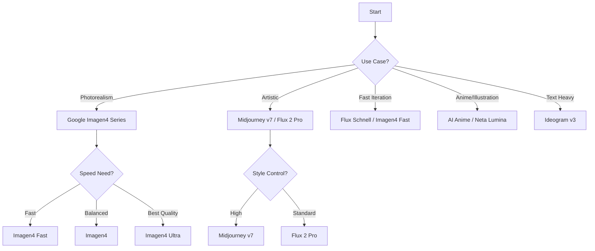

## Overview

Open Higgsfield AI provides access to 20+ state-of-the-art AI models for image and video generation. Each model has unique strengths, speed characteristics, and quality tradeoffs. This guide helps you select the optimal model for your use case.

## Model Categories

### Text-to-Image Models

Generate images from text descriptions alone. Perfect for concept exploration and creative ideation.

<AccordionGroup>
  <Accordion title="Flux Series - Versatile & High Quality">
    The Flux models offer excellent balance between quality and speed:

    - **Flux 2 Pro** - Highest quality, best for final production work
    - **Flux 2 Dev** - Great quality, faster generation
    - **Flux 2 Flex** - Balanced speed/quality, ideal for iteration
    - **Flux Schnell** - Ultra-fast, best for rapid prototyping
    - **Flux Dev** - Original Dev version, reliable baseline

    **Best for:** General-purpose image generation, photorealism, concept art

    **Resolutions:** Up to 2048×2048 (varies by model)
  </Accordion>

  <Accordion title="Google Imagen4 - Photorealistic Excellence">
    Google's Imagen4 series excels at photorealistic imagery:

    - **Google Imagen4 Ultra** - Maximum quality and realism
    - **Google Imagen4** - Balanced quality and speed
    - **Google Imagen4 Fast** - Quick generation with good quality

    **Best for:** Product photography, landscapes, realistic portraits

    **Aspect Ratios:** 16:9, 9:16, 1:1, 4:3, 3:4
  </Accordion>

  <Accordion title="Specialized Models">
    - **Midjourney v7** - Artistic stylization with variety controls
    - **Ideogram v3** - Excellent for text rendering and logos
    - **Nano Banana / Pro** - Fast generation with resolution options (1K-4K)
    - **Bytedance Seedream v3/v4** - Dreamy, ethereal aesthetics
    - **Kling O1** - High-quality with resolution control (1K-2K)

    **Best for:** Specific artistic styles, text-heavy designs, rapid iteration
  </Accordion>

  <Accordion title="Anime & Illustration Models">
    - **AI Anime Generator** - Dedicated anime/manga style
    - **Neta Lumina** - Painterly anime aesthetic
    - **Perfect Pony XL** - Character-focused illustrations

    **Best for:** Character art, anime-style content, stylized illustrations
  </Accordion>

  <Accordion title="Chinese Models - Cultural Excellence">
    - **Hunyuan Image 3.0** - Blend of classical and modern aesthetics
    - **Hunyuan Image 2.1** - Ink-wash landscape style
    - **Qwen Image** - High-quality general purpose
    - **Chroma Image** - Vibrant color focus

    **Best for:** Asian aesthetics, cultural art, ink paintings
  </Accordion>
</AccordionGroup>

## Quality vs Speed Tradeoffs

<CodeGroup>
```text Speed Priority
Fastest → Slowest:
1. Flux Schnell
2. Google Imagen4 Fast
3. Nano Banana
4. Hidream I1 Fast
5. Flux 2 Flex
```

```text Quality Priority
Highest → Standard:
1. Flux 2 Pro
2. Google Imagen4 Ultra
3. Midjourney v7 (with high stylization)
4. Flux 2 Dev
5. Google Imagen4
```
</CodeGroup>

<Tip>
**Pro Tip:** Start with faster models like Flux Schnell or Imagen4 Fast for iteration, then switch to Pro/Ultra models for final renders.
</Tip>

## Model-Specific Features

### Resolution Control

Some models offer granular resolution settings:

```javascript
// Models with custom width/height (divisible by 64)
Flux Dev, Flux 2 Dev, Hidream series
→ Width/Height: 128-2048, step: 64

// Models with resolution presets
Bytedance Seedream v4
→ Resolutions: 1K, 2K, 4K

Nano Banana Pro
→ Resolutions: 1k, 2k, 4k

Kling O1
→ Resolutions: 1k, 2k
```

### Aspect Ratio Support

<Info>
Most models support standard aspect ratios:
- Square: 1:1
- Landscape: 16:9, 4:3, 21:9
- Portrait: 9:16, 3:4
- Cinema: 3:2, 2:3
</Info>

### Advanced Features

**Midjourney v7** offers unique creative controls:

```json
{
  "speed": "relaxed" | "fast" | "turbo",
  "variety": 0-100 (step: 5),
  "stylization": 0-1000,
  "weirdness": 0-3000
}
```

**Ideogram v3** provides rendering modes:

```json
{
  "render_speed": "Turbo" | "Balanced" | "Quality",
  "style": "Auto" | "General" | "Realistic" | "Design"
}
```

## Popular Model Recommendations

<Steps>
  <Step title="For Beginners: Flux 2 Flex">
    Excellent balance of quality, speed, and ease of use. Supports resolution presets (1k/2k) and common aspect ratios.
  </Step>

  <Step title="For Photorealism: Google Imagen4">
    Produces highly realistic images quickly. Great for landscapes, products, and portraits.
  </Step>

  <Step title="For Artistic Work: Midjourney v7">
    Unmatched stylization options. Adjust variety, stylization, and weirdness for unique artistic styles.
  </Step>

  <Step title="For Iteration: Flux Schnell">
    Fastest generation time. Perfect for testing prompts and concepts before switching to quality models.
  </Step>

  <Step title="For Text Rendering: Ideogram v3">
    Best-in-class text generation. Ideal for logos, posters, and designs with readable text.
  </Step>

  <Step title="For Production: Flux 2 Pro or Imagen4 Ultra">
    Maximum quality for final deliverables. Worth the extra generation time.
  </Step>
</Steps>

## Model Selection Workflow



## Batch Generation

<Note>
Many models support generating multiple images in a single request via the `num_images` parameter (1-4 images). Each image counts as a separate API charge.
</Note>

Models supporting batch generation:
- Flux series (most variants)
- Google Imagen4 (except Ultra)
- Ideogram v3
- Bytedance Seedream v4
- Qwen Image
- Kling O1 (up to 9 images)

## Advanced: LoRA Models

**Flux Dev Lora** allows custom style training:

```json
{
  "model_id": [
    {
      "model": "civitai:119351@317153",
      "weight": 1.0
    }
  ]
}
```

- Find LoRA models on [Civitai](https://civitai.com)
- Apply up to 4 LoRA models simultaneously
- Weight range: 0-4 (default: 1)
- Format: `civitai:model_id@version_id`

<Warning>
LoRA models require specific prompt keywords to activate. Check the Civitai model page for trigger words.
</Warning>

## Next Steps

<CardGroup cols={2}>
  <Card title="API Configuration" icon="key" href="/guides/api-configuration">
    Set up your Muapi.ai API key
  </Card>
  <Card title="Cinema Studio" icon="video" href="/guides/camera-controls">
    Master cinematic camera controls
  </Card>
</CardGroup>